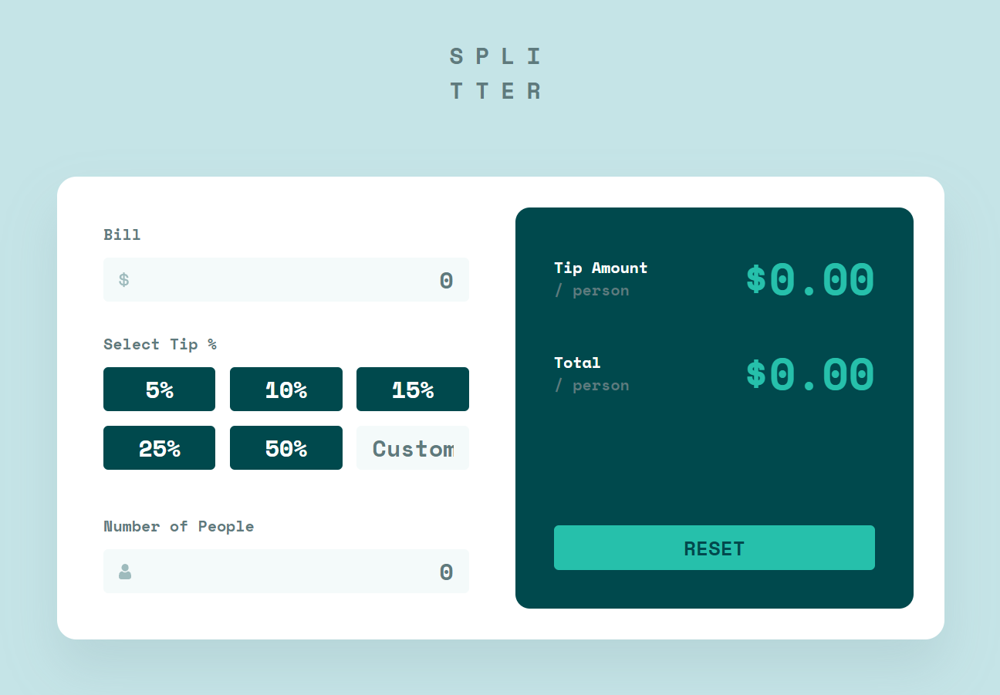

# Frontend Mentor - Tip calculator app solution

This is a solution to the [Tip calculator app challenge on Frontend Mentor](https://www.frontendmentor.io/challenges/tip-calculator-app-ugJNGbJUX). Frontend Mentor challenges help you improve your coding skills by building realistic projects.

### About

Fifteenth exercice from Frontend Mentor website. The purpose is to train to fondamentals web languages.

**HTML, CSS, JS**

[Preview-site](https://florianjourde.github.io/Frontend-Mentor-15-Tip-calculator-app)
